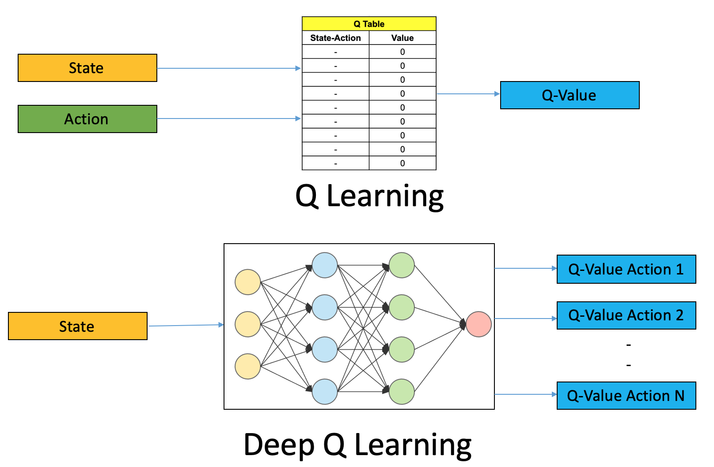

# reinforcment_learning_Network_FrozenLake
reinforcment learning Deep Q Network - Tensorflow - FrozenLake

The main difference with the first solution is that here we will use a Neural Network instead of an array for the State - Action reward evaluation Q.

Full desclaimer it is obvius that for this simple problem its an overkill to use tensorflow and neural networks the 1 solution enough.

The main difference with the original solution here is that, instead of keeping all the information and updating the rewards from an array of all possible state action combinations. Here we have a Neural Network that learn how to apply a reward to every state for all possible actions.

This is an amazing approach especially for problems that dont have a deterministic number of possible states, for example with games that your only input is the frame of the game

